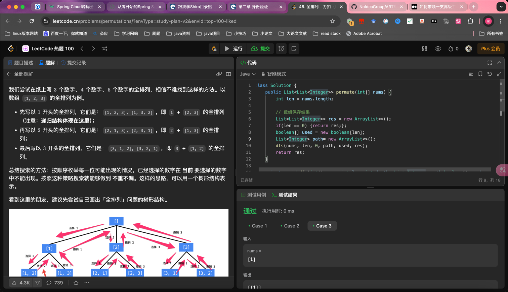

## Algorithm

回溯搜索
### 与动态规划的区别
- 共同点
用于求解多阶段决策问题。多阶段决策问题即：
求解一个问题分为很多步骤（阶段）；
每一个步骤（阶段）可以有多种选择。
- 不同点
动态规划只需要求我们评估最优解是多少，最优解对应的具体解是什么并不要求。因此很适合应用于评估一个方案的效果；
回溯算法可以搜索得到所有的方案（当然包括最优解），但是本质上它是一种遍历算法，时间复杂度很高。

### 核心思想

- 回溯取消路径上的搜索
- 采用试错的思想，它尝试分步的去解决一个问题。在分步解决问题的过程中，当它通过尝试发现现有的分步答案不能得到有效的正确的解答的时候，它将取消上一步甚至是上几步的计算，再通过其它的可能的分步解答再次尝试寻找问题的答案

## Review

[35 year software](https://dev.jimgrey.net/2024/07/03/lessons-learned-in-35-years-of-making-software/?ref=dailydev)
- 维持好的人际关系
- 永远不要隐形
- 提高效率
- 追逐冒险与兴趣
- 展现价值
- 当你交付你真正引以为豪的工作时，几乎可以肯定你做得太多、花了太长时间。我有一点完美主义倾向。我要把我的工作做好、彻底。我花了很长时间才明白，当我这样做时，是为了我自己，而不是为了公司。当我的事情达到我想要的 60-80% 时，我可能已经做得足够了

## Tip

## Share
