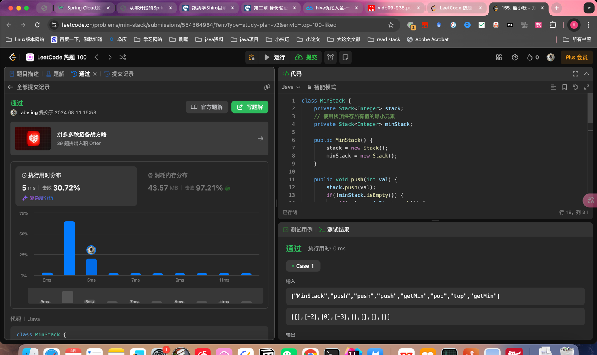

## Algorithm

- 通过栈保存所有栈的最小值，push，小于则push，pop相等则pop
- peek() 查询栈顶元素

## Review

[40thesis](https://medium.com/javarevisited/40-must-read-white-papers-to-learn-system-design-and-software-architecture-775c4197f9c8)
- 40篇论文软件设计

## Tip

## Share
