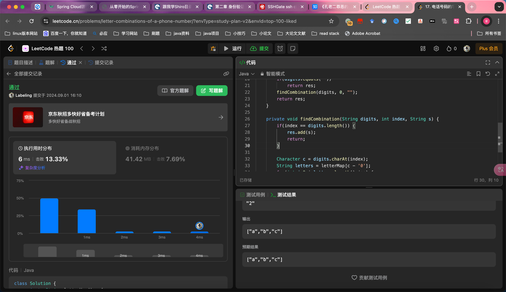

## Algorithm

- 回溯

- findCombination(String digits, int index, String s)

- s 存放结果 digits 存放数字 index 存放个数

## Review

[Optimizing Your Work-from-Home Setup for Career Success](https://dev.to/snmeans/optimizing-your-work-from-home-setup-for-career-success-47na?ref=dailydev)
- 持续学习
- 时间管理
- 适应变化

## Tip

## Share
