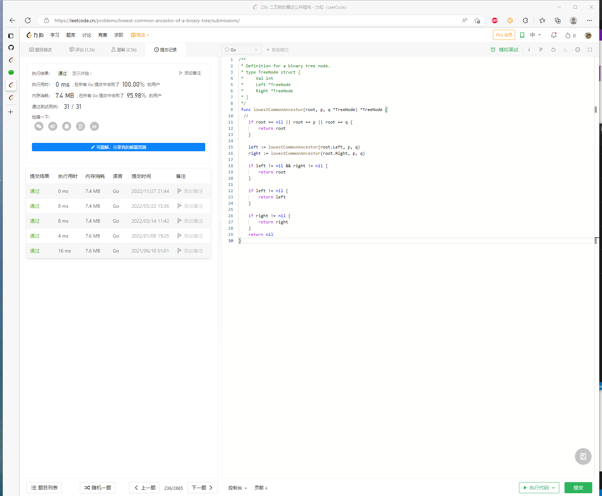

# Algorithm



# Review

[Chapter 10: Implementation and performance - pipeline](https://github.com/ongardie/dissertation#readme)

```

leader 和 follower 在 appendEntry 的时候，不需要等待 follower ack， 对比 batch 是 ping-pong 类型协议，能有效提升吞吐

1.单条 tcp 连接：跟 batch 没有多大区别，tcp 层面已经是串行，通过滑动窗口来批量发送，对端重组保证有序，跟 batch 效果差不多 ，raft 同步 log 类似 tcp，保证可靠有序的同时，在高延时情况下能充分利用带宽
2.多条 tcp 连接：多个 tcp 连接不能保证消息有序，后发送的有可能先到达，由于一致性检查的存在，后发送的会失败，这里可以仿照 tcp 的实现，类似滑动窗口，如果发现之前的内容还没到达，可以在内存中保留一份  buffer， 这样可以避免重传

问题：
	1. 多条 rpc 连接， 由于 appendEntry 的一致性检查存在，消息乱序没关系，会重试（这里能否减少重试？先到的较大 index 消息先缓存到 buffer，保存多久？ 现有 leader 挂了切换如何处理？）
	2. Leader 发送 log 后直接推进 next_idx: 目前 leader 发送 log 同步是直接按照当前 next_idx 之后的所有 log 一起打包给 follower，需要等待 follower 的回包来推进 next_idx，每次有新消息 propose 时，也会直接从当前 next_idx 开始的 log 全部发给 follower ，若之前的消息 follower 还没处理完成，next_idx 没有向前推进，相当于会重复发送不必要的 entry？
```

# Tip

# Share
