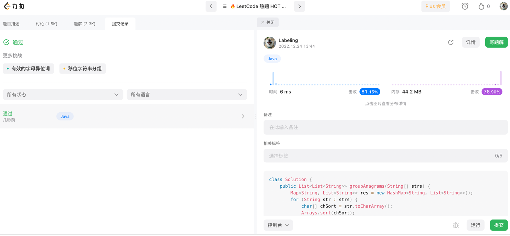

## Algorithm

* 字符串sort `string.toCharArray|Arrays.sort()|String.valueOf()`
* map转list `new ArrayList(map.valuse())`
## Review
[java函数编程](https://www.baeldung.com/java-functional-programming)

### Function
```java
Function<Double, Double> log = (value) -> Math.log(value);
Function<Double, Double> sqrt = (value) -> Math.sqrt(value);
// 先log再sqrt
Function<Double, Double> logThenSqrt = sqrt.compose(log);
// 先sqrt再log
Function<Double, Double> sqrtThenLog = sqrt.andThen(log);
```

### Predicate
```java
@Test
public void testPredicate() {
    Predicate<Number> more2 = this::more2;
    Predicate<Number> more4 = this::more4;
    System.out.println(more2.or(more4).test(3.5));

}
public <T extends Number> boolean more2(T v) {
    return v.intValue() > 2;
}
public <T extends Number >boolean more4(T v) {
    return v.intValue() > 4;
}
```

### BiFunction
```java
@Test
public void testBiFunction() {
    BiFunction<Integer, Integer, Integer> deductBiFunction = (o, o2) -> o - o2;
    Function<Integer, Integer> plus10 = (o) -> o + 10;
    // 5-10+10=5
    Assert.assertEquals("5", deductBiFunction.andThen(plus10).apply(5, 10).toString());
}
```
## Tip

## Share


