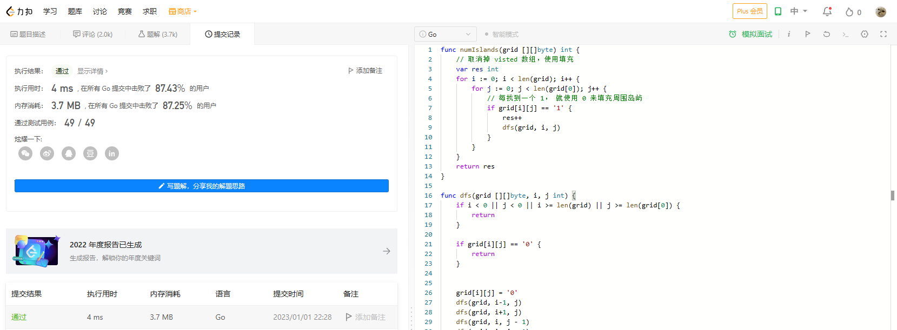

# Algorithm

# Review

[LearnConcurrency](https://github.com/golang/go/wiki/LearnConcurrency)

# Tip

无

# Share

[短地址服务设计的一些思路](https://fuschia-route-dbf.notion.site/e5dd5771ad254098aae4abf9102c7ddc)
