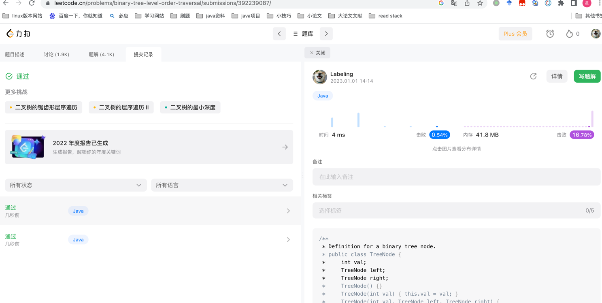

## Algorithm

* 层序遍历，使用Queue
## Review
[java Queue介绍](https://www.baeldung.com/java-queue)
> * offer() – Inserts a new element onto the Queue
> * poll() – Removes an element from the front of the Queue
> * peek() – Inspects the element at the front of the Queue, without removing it
## Tip
java 异步编排
在Java 8中, 新增加了一个包含50个方法左右的类: CompletableFuture，提供了非常强大的Future的扩展功能，可以帮助我们简化异步编程的复杂性，提供了函数式编程的能力，可以通过回调的方式处理计算结果，并且提供了转换和组合CompletableFuture的方法。
多任务组合
```java
public static CompletableFuture<Void> allOf(CompletableFuture<?>... cfs);

public static CompletableFuture<Object> anyOf(CompletableFuture<?>... cfs);
```
例子：
```java
@Test
public void testFuture() {
    CompletableFuture<String> future1 = CompletableFuture.supplyAsync(()->{
        System.out.println("带有返回值的异步任务");
        return "a future value";
    });
    CompletableFuture<String> future2 = CompletableFuture.supplyAsync(()->{
        System.out.println("带有返回值的异步任务");
        try {
            Thread.sleep(200);
        } catch (InterruptedException e) {
            throw new RuntimeException(e);
        }
        return "a future value2";
    });
    CompletableFuture.allOf(future1, future2);
    String s = future1.get();
    Assert.assertEquals("a future value",s);
    Assert.assertEquals("a future value2",future2.get());
}
```

## Share
java Stream 编程
* 支持数组聚合
* Map转List
* 通用map方法
* 通用filter方法
* 通用foreach
定义数据：
```java
private List<Apple> apples;
public MapClientTest() {
    List<Apple> appleList = new ArrayList<>();//存放apple对象集合

    Apple apple1 =  new Apple(1,"苹果1",new BigDecimal("3.25"),10);
    Apple apple12 = new Apple(1,"苹果2",new BigDecimal("1.35"),20);
    Apple apple2 =  new Apple(2,"香蕉",new BigDecimal("2.89"),30);
    Apple apple3 =  new Apple(3,"荔枝",new BigDecimal("9.99"),40);

    appleList.add(apple1);
    appleList.add(apple12);
    appleList.add(apple2);
    appleList.add(apple3);
    this.apples = appleList;
}
class Apple {
    private Integer id;
    private String name;
    private BigDecimal money;
    private Integer num;

    public Apple(Integer id, String name, BigDecimal money, Integer num) {
        this.id = id;
        this.name = name;
        this.money = money;
        this.num = num;
    }
}
```
```java
@Test
public void testGroupingBy() {
    Map<Integer, List<Apple>> collect = apples.stream().collect(Collectors.groupingBy(Apple::getId));
    System.out.println(collect);
}

/**
 * 测试列表转换映射
 * param1 需要的key
 * param2 需要的value
 * param3 需要的key冲突value处理方式
 */
@Test
public void testListConvertMap() {
    Map<Integer, String> collect = apples.stream().collect(Collectors.toMap(Apple::getId, Apple::getName, (s, s2) -> s+s2));
    System.out.println(collect);
}

/**
 * 测试和
 */
@Test
public void testSum() {
    BigDecimal reduce = apples.stream().map(Apple::getMoney).reduce(new BigDecimal(20), BigDecimal::add);
    System.out.println(reduce);
    // 17.48
}

@Test
public void testMaxAndMin() {
    Optional<Apple> max = apples.stream().max(Comparator.comparing(Apple::getMoney));
    max.ifPresent(System.out::println);
}

@Test
public void testReduce() {
    int reduce = Arrays.stream(new int[]{5, 2, 8}).reduce(0, (a, b) -> a / b);
    System.out.println(reduce);
    Function<String, String> identity = Function.identity();
    String apply = identity.apply("222");
    System.out.println(apply);
}

@Test
public void toMap() {
    Map<Integer, Apple> collect = apples.stream().collect(Collectors.toMap(Apple::getId, Function.identity(), (key1, key2) -> key1));
    System.out.println(collect);
}
```


