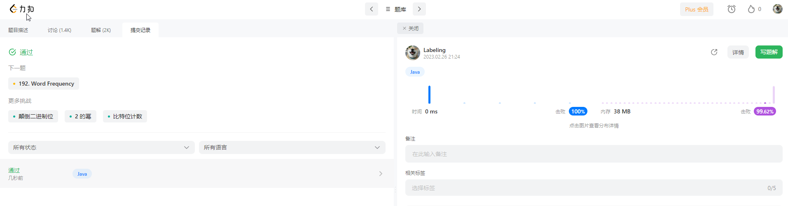

## Algorithm

* 减一相与
## Review
[Apache ranger](https://docs.cloudera.com/runtime/7.2.10/security-ranger-authorization/topics/security-ranger-provide-authorization-cdp.html)
## Tip
* 以接口的粒度进行工作量分析
* 注意排事情优先级
* 保存接口进程测试
* Mybatis拦截扩展，SQL解析器解析设置where
```java
public void testSelectOneTable() throws JSQLParserException {
    // 单表全量
    Table table = new Table("test");
    Select select = SelectUtils.buildSelectFromTable(table);
    System.err.println(select); // SELECT * FROM test

    // 指定列查询
    Select buildSelectFromTableAndExpressions = SelectUtils.buildSelectFromTableAndExpressions(new Table("test"), new Column("col1"), new Column("col2"));
    System.err.println(buildSelectFromTableAndExpressions); // SELECT col1, col2 FROM test

    // WHERE =
    EqualsTo equalsTo = new EqualsTo(); // 等于表达式
    equalsTo.setLeftExpression(new Column(table, "user_id")); // 设置表达式左边值
    equalsTo.setRightExpression(new StringValue("123456"));// 设置表达式右边值
    PlainSelect plainSelect = (PlainSelect) select.getSelectBody(); // 转换为更细化的Select对象
    plainSelect.setWhere(equalsTo);
    System.err.println(plainSelect);//  SELECT * FROM test WHERE test.user_id = '123456'

    // WHERE  != <>
    NotEqualsTo notEqualsTo = new NotEqualsTo();
    notEqualsTo.setLeftExpression(new Column(table, "user_id")); // 设置表达式左边值
    notEqualsTo.setRightExpression(new StringValue("123456"));// 设置表达式右边值
    PlainSelect plainSelectNot = (PlainSelect) select.getSelectBody();
    plainSelectNot.setWhere(notEqualsTo);
    System.err.println(plainSelectNot);//  SELECT * FROM test WHERE test.user_id <> '123456'

    // 其他运算符, 参考上面代码添加表达式即可
    GreaterThan gt = new GreaterThan(); // ">"
    GreaterThanEquals geq = new GreaterThanEquals(); // ">="
    MinorThan mt = new MinorThan(); // "<"
    MinorThanEquals leq = new MinorThanEquals();// "<="
    IsNullExpression isNull = new IsNullExpression(); // "is null"
    isNull.setNot(true);// "is not null"
    LikeExpression nlike = new LikeExpression();
    nlike.setNot(true); // "not like"
    Between bt = new Between();
    bt.setNot(true);// "not between"

    // WHERE LIKE
    LikeExpression likeExpression = new LikeExpression(); // 创建Like表达式对象
    likeExpression.setLeftExpression(new Column("username")); // 表达式左边
    likeExpression.setRightExpression(new StringValue("张%")); // 右边表达式
    PlainSelect plainSelectLike = (PlainSelect) select.getSelectBody();
    plainSelectLike.setWhere(likeExpression);
    System.err.println(plainSelectLike); // SELECT * FROM test WHERE username LIKE '张%'

    // WHERE IN
    Set<String> deptIds = Sets.newLinkedHashSet(); // 创建IN范围的元素集合
    deptIds.add("0001");
    deptIds.add("0002");
    ItemsList itemsList = new ExpressionList(deptIds.stream().map(StringValue::new).collect(Collectors.toList())); // 把集合转变为JSQLParser需要的元素列表
    InExpression inExpression = new InExpression(new Column("dept_id "), itemsList); // 创建IN表达式对象，传入列名及IN范围列表
    PlainSelect plainSelectIn = (PlainSelect) select.getSelectBody();
    plainSelectIn.setWhere(inExpression);
    System.err.println(plainSelectIn); // SELECT * FROM test WHERE dept_id  IN ('0001', '0002')

    // WHERE BETWEEN AND
    Between between = new Between();
    between.setBetweenExpressionStart(new LongValue(18)); // 设置起点值
    between.setBetweenExpressionEnd(new LongValue(30)); // 设置终点值
    between.setLeftExpression(new Column("age")); // 设置左边的表达式，一般为列
    PlainSelect plainSelectBetween = (PlainSelect) select.getSelectBody();
    plainSelectBetween.setWhere(between);
    System.err.println(plainSelectBetween); // SELECT * FROM test WHERE age BETWEEN 18 AND 30

    //  WHERE AND 多个条件结合,都需要成立
    AndExpression andExpression = new AndExpression(); // AND 表达式
    andExpression.setLeftExpression(equalsTo); // AND 左边表达式
    andExpression.setRightExpression(between);  // AND 右边表达式
    PlainSelect plainSelectAnd = (PlainSelect) select.getSelectBody();
    plainSelectAnd.setWhere(andExpression);
    System.err.println(plainSelectAnd); //  SELECT * FROM test WHERE test.user_id = '123456' AND age BETWEEN 18 AND 30

    //  WHERE OR 多个条件满足一个条件成立返回
    OrExpression orExpression = new OrExpression();// OR 表达式
    orExpression.setLeftExpression(equalsTo); // OR 左边表达式
    orExpression.setRightExpression(between);  // OR 右边表达式
    PlainSelect plainSelectOr = (PlainSelect) select.getSelectBody();
    plainSelectOr.setWhere(orExpression);
    System.err.println(plainSelectOr); // SELECT * FROM test WHERE test.user_id = '123456' OR age BETWEEN 18 AND 30

    // ORDER BY 排序
    OrderByElement orderByElement = new OrderByElement(); // 创建排序对象
    orderByElement.isAsc(); //  设置升序排列 从小到大
    orderByElement.setExpression(new Column("col01")); // 设置排序字段
    PlainSelect plainSelectOrderBy = (PlainSelect) select.getSelectBody();
    plainSelectOrderBy.addOrderByElements(orderByElement);
    System.err.println(plainSelectOrderBy); // SELECT * FROM test WHERE test.user_id = '123456' OR age BETWEEN 18 AND 30 ORDER BY col01
}
```
## Share