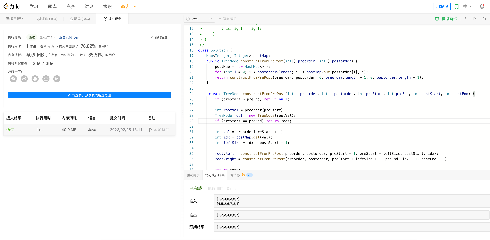

# Algorithm

# Review

[The technology behind GitHub’s new code search](https://github.blog/2023-02-06-the-technology-behind-githubs-new-code-search)

# Tip

# Share

[Kubernetes Cluster Autoscaler 原理 & 对接介绍](https://zhenran.notion.site/Kubernetes-Cluster-Autoscaler-1f36f338059f4250bc20ffee21de96b1)