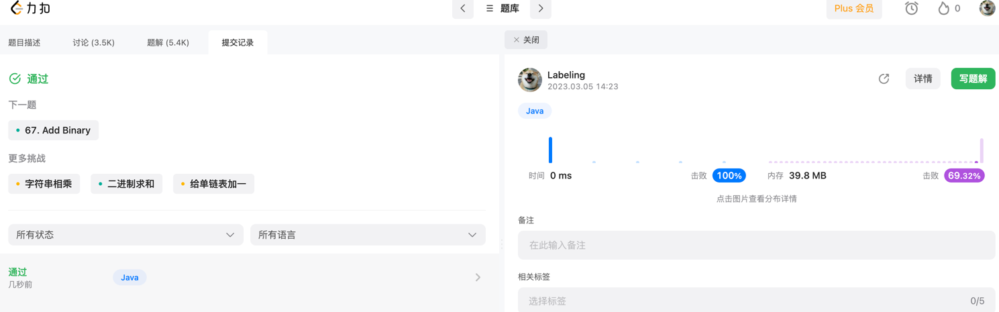

## Algorithm

* 数组加法
## Review
[mysql 主备介绍](https://hevodata.com/learn/mysql-master-slave-replication/)
## Tip

## Share
最近在了解实践DDD，这里看下阿里的DDD解读
[DDD第一讲](https://developer.aliyun.com/article/713097?spm=a2c6h.12873639.article-detail.83.2aba27c9p52wPw)
### 问题
> 一个新应用在全国通过 地推业务员 做推广，需要做一个用户注册系统，同时希望在用户注册后能够通过用户电话（先假设仅限座机）的地域（区号）对业务员发奖金。
```java
public class User {
    Long userId;
    String name;
    String phone;
    String address;
    Long repId;
}

public class RegistrationServiceImpl implements RegistrationService {

    private SalesRepRepository salesRepRepo;
    private UserRepository userRepo;

    public User register(String name, String phone, String address) 
      throws ValidationException {
        // 校验逻辑
        if (name == null || name.length() == 0) {
            throw new ValidationException("name");
        }
        if (phone == null || !isValidPhoneNumber(phone)) {
            throw new ValidationException("phone");
        }
        // 此处省略address的校验逻辑

        // 取电话号里的区号，然后通过区号找到区域内的SalesRep
        String areaCode = null;
        String[] areas = new String[]{"0571", "021", "010"};
        for (int i = 0; i < phone.length(); i++) {
            String prefix = phone.substring(0, i);
            if (Arrays.asList(areas).contains(prefix)) {
                areaCode = prefix;
                break;
            }
        }
        SalesRep rep = salesRepRepo.findRep(areaCode);

        // 最后创建用户，落盘，然后返回
        User user = new User();
        user.name = name;
        user.phone = phone;
        user.address = address;
        if (rep != null) {
            user.repId = rep.repId;
        }

        return userRepo.save(user);
    }

    private boolean isValidPhoneNumber(String phone) {
        String pattern = "^0[1-9]{2,3}-?\\d{8}$";
        return phone.matches(pattern);
    }
}
```
* 接口的清晰度（可阅读性）
`User register(String, String, String)`;
String 没有抽取类型，基本类型偏执
* 数据验证和错误处理
BeanValidation：
通常只能解决简单的校验逻辑，复杂的校验逻辑一样要写代码实现定制校验器
在添加了新校验逻辑时，同样会出现在某些地方忘记添加一个注解的情况，DRY原则还是会被违背
ValidationUtils类：
当大量的校验逻辑集中在一个类里之后，违背了Single Responsibility单一性原则，导致代码混乱和不可维护
业务异常和校验异常还是会混杂
* 业务逻辑代码的清晰度
业务逻辑抽取
```java
private static String findAreaCode(String phone) {
    for (int i = 0; i < phone.length(); i++) {
        String prefix = phone.substring(0, i);
        if (isAreaCode(prefix)) {
            return prefix;
        }
    }
    return null;
}

private static boolean isAreaCode(String prefix) {
    String[] areas = new String[]{"0571", "021"};
    return Arrays.asList(areas).contains(prefix);
}
```
而为了复用以上的方法，可能会抽离出一个静态工具类PhoneUtils。但是这里要思考的是，静态工具类是否是最好的实现方式呢？当你的项目里充斥着大量的静态工具类，业务代码散在多个文件当中时，你是否还能找到核心的业务逻辑呢？
* 可测试性
### 解决方案
一个新应用在全国通过 **地推业务员** 做推广，需要做一个用户的**注册系统**，在用户注册后能够通过用户**电话号的区号**对业务员发奖金。
将隐性概念显性化
在这里，我们可以看到，原来电话号仅仅是用户的一个参数，属于隐形概念，但实际上电话号的区号才是真正的业务逻辑，而我们需要将电话号的概念显性化，通过写一个Value Object：
```java
public class PhoneNumber {
  
    private final String number;
    public String getNumber() {
        return number;
    }

    public PhoneNumber(String number) {
        if (number == null) {
            throw new ValidationException("number不能为空");
        } else if (isValid(number)) {
            throw new ValidationException("number格式错误");
        }
        this.number = number;
    }

    public String getAreaCode() {
        for (int i = 0; i < number.length(); i++) {
            String prefix = number.substring(0, i);
            if (isAreaCode(prefix)) {
                return prefix;
            }
        }
        return null;
    }

    private static boolean isAreaCode(String prefix) {
        String[] areas = new String[]{"0571", "021", "010"};
        return Arrays.asList(areas).contains(prefix);
    }

    public static boolean isValid(String number) {
        String pattern = "^0?[1-9]{2,3}-?\\d{8}$";
        return number.matches(pattern);
    }
}
```
* VO 不可变
* 校验在构造函数
* 内聚业务方法

这样做完之后，我们发现把PhoneNumber显性化之后，其实是生成了一个Type（数据类型）和一个Class（类）：
Type指我们在今后的代码里可以通过PhoneNumber去显性的标识电话号这个概念
Class指我们可以把所有跟电话号相关的逻辑完整的收集到一个文件里
这两个概念加起来，构造成了本文标题的**Domain Primitive（DP**）。

重构第一版本
```java
public class User {
    UserId userId;
    Name name;
    PhoneNumber phone;
    Address address;
    RepId repId;
}

public User register(
  @NotNull Name name, 
  @NotNull PhoneNumber phone, 
  @NotNull Address address
) {
    // 找到区域内的SalesRep
    SalesRep rep = salesRepRepo.findRep(phone.getAreaCode());

    // 最后创建用户，落盘，然后返回，这部分代码实际上也能用Builder解决
    User user = new User();
    user.name = name;
    user.phone = phone;
    user.address = address;
    if (rep != null) {
        user.repId = rep.repId;
    }

    return userRepo.saveUser(user);
}
```

我们可以看到在使用了DP之后，所有的数据验证逻辑和非业务流程的逻辑都消失了，剩下都是核心业务逻辑，可以一目了然。我们重新用上面的四个维度评估一下：
接口清晰度
```java
public User register(Name, PhoneNumber, Address)
```
数据验证
```java
public User register(
  @NotNull Name name, 
  @NotNull PhoneNumber phone, 
  @NotNull Address address
) // no throws
```
业务代码清晰度
```java
// 找到区域内的SalesRep
SalesRep rep = salesRepRepo.findRep(phone.getAreaCode());
return userRepo.save(user);
```

### 评估总结

| 维度 | 传统代码 | 使用Domain Primitive |
| --- | --- | --- |
| API接口清晰度 | 含混不清 | 接口清晰可读 |
| 数据校验、错误处理 | 校验逻辑分布多个地方，大量重复代码 | 校验逻辑内聚，在接口边界外完成 |
| 业务代码的清晰度 | 校验代码，胶水代码，业务逻辑混杂 | 无胶水代码，业务逻辑清晰可读 |
| 测试复杂度 | N _M_ P | N + M + P |
| 其他好处 |  | 将隐含的概念显性化**整体安全性大大提升**Immutability不可变**线程安全** |  

### 使用Domain Primitive的三原则

-   让隐性的概念显性化
-   让隐性的上下文显性化
-   封装多对象行为

### 什么情况下应该用Domain Primitive

常见的DP的使用场景包括：

-   有格式限制的`String`：比如`Name`，`PhoneNumber`，`OrderNumber`，`ZipCode`，`Address`等
-   有限制的`Integer`：比如`OrderId`（>0），`Percentage`（0-100%），`Quantity`（>=0）等
-   可枚举的`int`：比如`Status`（一般不用Enum因为反序列化问题）
-   `Double`或`BigDecimal`：一般用到的`Double`或`BigDecimal`都是有业务含义的，比如`Temperature`、`Money`、`Amount`、`ExchangeRate`、`Rating`等
-   复杂的数据结构：比如`Map<String, List<Integer>>`等，尽量能把`Map`的所有操作包装掉，仅暴露必要行为