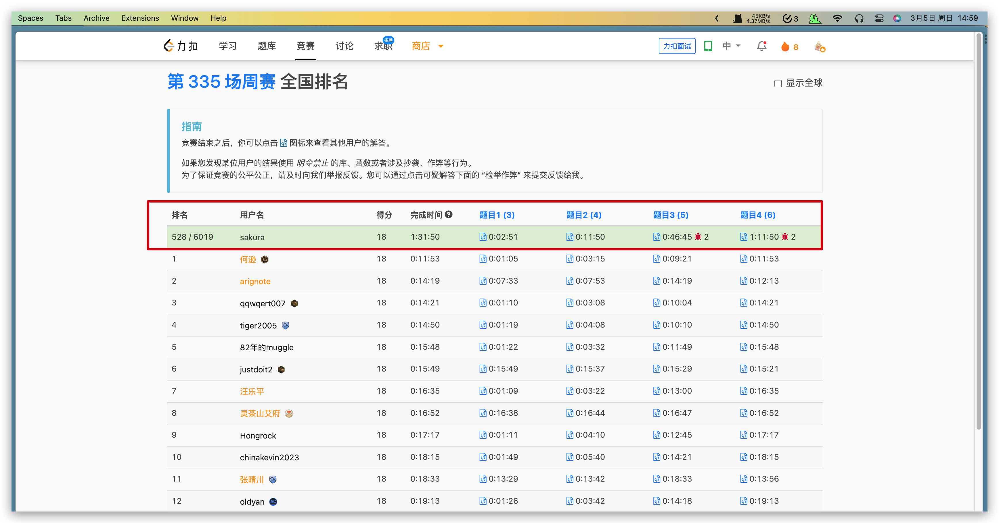

## Algorithm

# Review

[Sharing Data Between Microservices](https://medium.com/@denhox/sharing-data-between-microservices-fe7fb9471208)

「微服务之间共享数据源」与 「微服务之间共享数据」
微服务之间共享数据源不可行，微服务之间共享数据是可行的。
在使用微服务之后，整体链路上依赖服务过多。会导致链路复杂，延时与可用性都会变差。所以可以通过共享数据的方式，减轻影响。共享数据需要权衡是否可以接受最终一致性、共享数据的资源消耗以及复杂度。
# Tips

# Share
