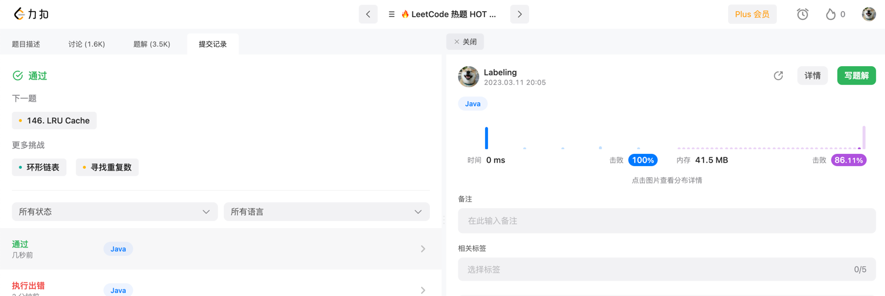

## Algorithm


## Review

[ddd cqrs](https://medium.com/design-microservices-architecture-with-patterns/cqrs-design-pattern-in-microservices-architectures-5d41e359768c
)

## Tip
map struct转换支持枚举.操作
```java
@Mappings({
            @Mapping(source = "id", target = "userId"),
            @Mapping(source = "name", target = "userName")
    })
指定别名

@Mapping(target = "description", source = "person.description")
@Mapping(target = "houseNumber", source = "address.houseNo")
DeliveryAddressDto personAndAddressToDeliveryAddressDto(Person person, Address address);
制定方法
```

## Share
