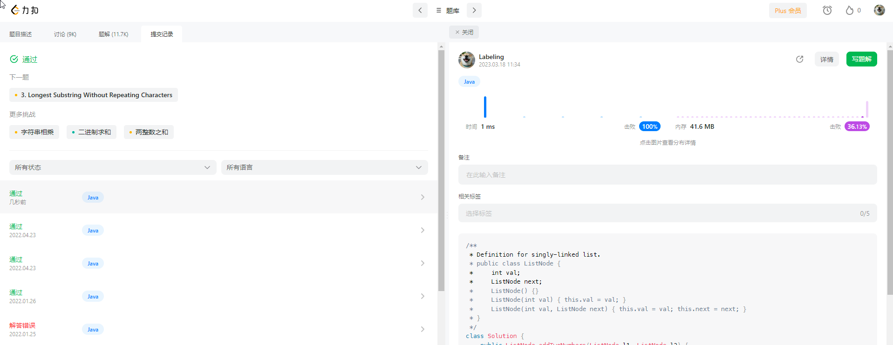
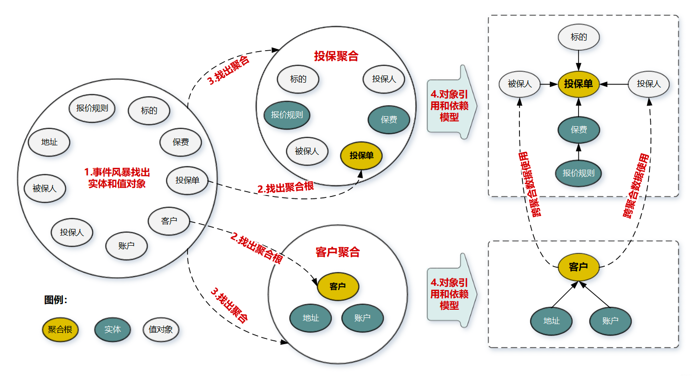

## Algorithm



## Review
[数据仓库](https://www.oracle.com/sg/database/what-is-a-data-warehouse/)
* 数据仓库的介绍

## Tip

## Share

### 值对象
将描述实体属性的值抽取为对象。
[值对象](https://cloud.tencent.com/developer/article/1790794)
```java
public class Persion {
    public String id;
    public String name;
    // 值对象
    public Address address;
}
public class Persion {
    public String id;
    public String name;
    
    public String city;
    public String country;
    public String street;
}
```
### 聚合根
实体和值对象组成聚合，再根据业务，将多个聚合划定到同一限界上下文，并在限界上下文内完成领域建模。 
#### 聚合
* 实体一般对应业务对象，具有业务属性和业务行为
* 值对象主要是属性集合，描述实体的状态和特征
聚合由业务和逻辑紧密关联的实体和值对象组合而成，是数据修改和持久化的基本单元，每个聚合对应一个仓储，实现数据的持久化。
#### 聚合根
若把聚合比作组织，则聚合根就是该组织负责人。聚合根也称为根实体，它不仅是实体，还是聚合的管理者。

* 作为实体，拥有实体的属性和业务行为，实现自身的业务逻辑
* 作为聚合的管理者，在聚合内部负责协调实体和值对象按照固定业务规则协同完成共同的业务逻辑。

在聚合间，它还是聚合对外的接口人，以聚合根ID关联的方式接受外部任务和请求，在上下文内实现聚合之间的业务协同。
即聚合间通过聚合根ID关联引用，若需要访问其它聚合的实体，就要先访问聚合根，再导航到聚合内部实体，外部对象不能直接访问聚合内实体。

在聚合内根据聚合根、实体和值对象的依赖关系，画出对象的引用和依赖模型。
聚合根就是聚合所有实体或者值对象的实体


