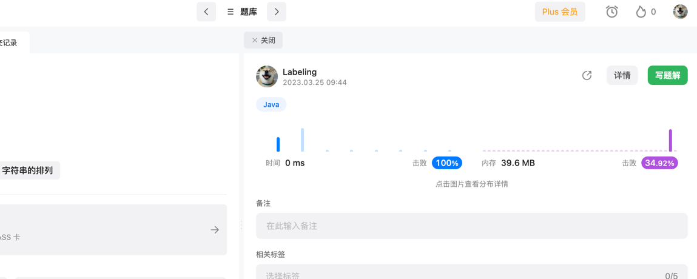

## Algorithm



## Review

[微服务架构与设计模式](https://medium.com/@madhukaudantha/microservice-architecture-and-design-patterns-for-microservices-e0e5013fd58a)

## Tip
工作中需要用到请求校验，这里梳理下Spring用到的Request校验
* 注意如果单参数需要再controller上加@Validated
Request请求校验
分组校验
在实际项目中，可能多个方法需要使用同一个DTO类来接收参数，而不同方法的校验规则很可能是不一样的。这个时候，简单地在DTO类的字段上加约束注解无法解决这个问题。因此，spring-validation支持了分组校验的功能，专门用来解决这类问题。还是上面的例子，比如保存User的时候，UserId是可空的，但是更新User的时候，UserId的值必须>=10000000000000000L；其它字段的校验规则在两种情况下一样。这个时候使用分组校验的代码示例如下：
```java
@Data
public class UserDTO {

    @Min(value = 10000000000000000L, groups = Update.class)
    private Long userId;

    @NotNull(groups = {Save.class, Update.class})
    @Length(min = 2, max = 10, groups = {Save.class, Update.class})
    private String userName;

    @NotNull(groups = {Save.class, Update.class})
    @Length(min = 6, max = 20, groups = {Save.class, Update.class})
    private String account;

    @NotNull(groups = {Save.class, Update.class})
    @Length(min = 6, max = 20, groups = {Save.class, Update.class})
    private String password;

    /**
     * 保存的时候校验分组
     */
    public interface Save {
    }

    /**
     * 更新的时候校验分组
     */
    public interface Update {
    }
}
```
使用
```java
@PostMapping("/save")
public Result saveUser(@RequestBody @Validated(UserDTO.Save.class) UserDTO userDTO) {
    // 校验通过，才会执行业务逻辑处理
    return Result.ok();
}

@PostMapping("/update")
public Result updateUser(@RequestBody @Validated(UserDTO.Update.class) UserDTO userDTO) {
    // 校验通过，才会执行业务逻辑处理
    return Result.ok();
}
```

前面的示例中，DTO类里面的字段都是基本数据类型和String类型。但是实际场景中，有可能某个字段也是一个对象，这种情况先，可以使用嵌套校验。比如，上面保存User信息的时候同时还带有Job信息。需要注意的是，此时DTO类的对应字段必须标记@Valid注解。

集合校验
如果请求体直接传递了json数组给后台，并希望对数组中的每一项都进行参数校验。此时，如果我们直接使用java.util.Collection下的list或者set来接收数据，参数校验并不会生效！我们可以使用自定义list集合来接收参数：

包装List类型，并声明@Valid注解


### 自定义校验

业务需求总是比框架提供的这些简单校验要复杂的多，我们可以自定义校验来满足我们的需求。自定义`spring validation`非常简单，假设我们自定义`加密id`（由数字或者`a-f`的字母组成，`32-256`长度）校验，主要分为两步：

-   **自定义约束注解**

```
@Target({METHOD, FIELD, ANNOTATION_TYPE, CONSTRUCTOR, PARAMETER})
@Retention(RUNTIME)
@Documented
@Constraint(validatedBy = {EncryptIdValidator.class})
public @interface EncryptId {

    // 默认错误消息
    String message() default "加密id格式错误";

    // 分组
    Class<?>[] groups() default {};

    // 负载
    Class<? extends Payload>[] payload() default {};
}
```

-   实现`ConstraintValidator`接口编写约束校验器

```
public class EncryptIdValidator implements ConstraintValidator<EncryptId, String> {

    private static final Pattern PATTERN = Pattern.compile("^[a-f\\d]{32,256}$");

    @Override
    public boolean isValid(String value, ConstraintValidatorContext context) {
        // 不为null才进行校验
        if (value != null) {
            Matcher matcher = PATTERN.matcher(value);
            return matcher.find();
        }
        return true;
    }
}
```

这样我们就可以使用`@EncryptId`进行参数校验了！
https://segmentfault.com/a/1190000023471742
## Share