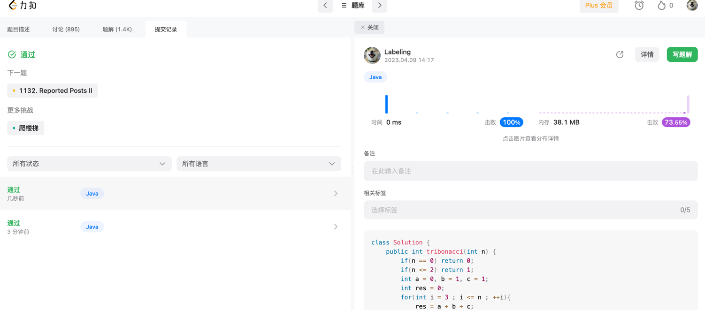

## Algorithm



## Review

[微服务问题面试](https://medium.com/javarevisited/top-10-microservices-problem-solving-questions-for-5-to-10-years-experienced-developers-3391e4f6b591)

1 kafka保证服务恢复后消费消息
2 多用户集群认证
3 缓存及其批处理
4 token加密
5 反馈限流
6 多服务速度排查
7 检查多消息队列消费问题
8 数据不一致 kafka flink adapter模式
9 数据库死锁 检查锁 加锁 分布式事务
10 访问慢 异步 加缓存
## Tip
自定义validate utils进行校验
定义
```java
package com.hx.ddd.infrastructure.util;

import lombok.extern.slf4j.Slf4j;
import org.springframework.util.CollectionUtils;

import javax.validation.ConstraintViolation;
import javax.validation.Validation;
import javax.validation.Validator;
import javax.validation.groups.Default;
import java.util.HashMap;
import java.util.Map;
import java.util.Set;

/**
 * jsr3自定义校验
 *
 * @author kyle
 * @date 2023/04/09
 */
@Slf4j
public class ValidateUtils {

    /**
     * 验证器
     */
    private static Validator validator = Validation.buildDefaultValidatorFactory().getValidator();

    /**
     * 使用指定分组
     *
     * @param object 被校验的bean
     * @param groups 分组
     * @return
     */
    public static <T> Map<String, StringBuilder> validate(T object, Class<?>... groups) {
        Map<String, StringBuilder> errorMap = new HashMap<>(16);
        if (groups == null) {
            groups = new Class[]{Default.class};
        }
        Set<ConstraintViolation<T>> set = validator.validate(object, groups);
        if (CollectionUtils.isEmpty(set)) {
            return null;
        }
        String property;
        for (ConstraintViolation<T> c : set) {
            // 这里循环获取错误信息，可以自定义格式
            property = c.getPropertyPath().toString();
            if (errorMap.get(property) != null) {
                errorMap.get(property).append(",").append(c.getMessage());
            } else {
                StringBuilder sb = new StringBuilder();
                sb.append(c.getMessage());
                errorMap.put(property, sb);
            }
        }
        if (!CollectionUtils.isEmpty(errorMap)) {
            log.info("------参数校验失败:{}", errorMap);
            throw new IllegalArgumentException("参数校验失败" +  errorMap);
        }
        return errorMap;
    }

}

```
使用
```java
public class ValidateUtilsTest {

    private ExpectedException expectedException = ExpectedException.none();

    @Data
    class Apple {
        @NotNull(message = "参数不能为空")
        Integer id;
    }

    @Test
    public void testApple() {
        Apple apple = new Apple();
        Assert.assertThrows("测试", IllegalArgumentException.class, () -> ValidateUtils.validate(apple));
    }
}
```
## Share

