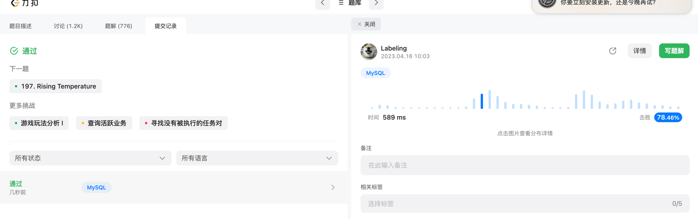

## Algorithm

## Review

[分布式服务](https://iorilan.medium.com/i-asked-this-system-design-question-to-3-guys-during-a-developer-interview-and-none-of-them-gave-9c23abe45687)
* 分布式锁
* 两阶段
* 三阶段
* TCC

## Tip

## Share

[老代码重构](https://mp.weixin.qq.com/s/v4SCAHNTs2G6XFJCLXu2xw)

* 从最开始业务建模开始梳理进行重构
* 借助新业务，新老业务并行进行立项
* 使用CQRS进行修改查询区分