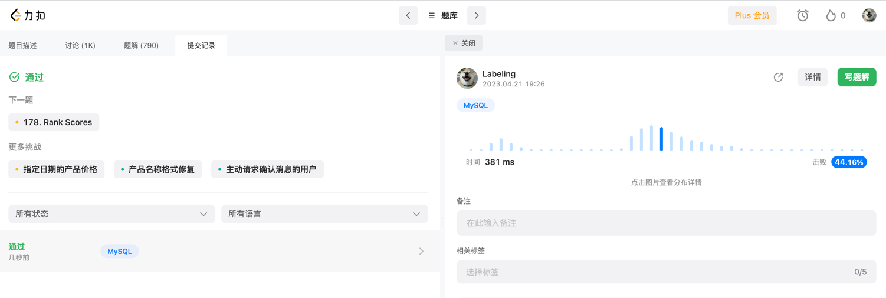

## Algorithm



* limit N 取一位
* distinct + order by

## Review

[简单微服务结构](https://medium.com/design-microservices-architecture-with-patterns/microservices-architecture-for-enterprise-large-scaled-application-825436c9a78a)


## Tip

学习至少一个技术技巧。主要是为了总结和归纳你在日常工作中所遇到的知识点。
java @Pattern List进行校验
```java
@Pattern.List({ @Pattern(regexp = "[1-9]", message = "xx"), @Pattern(regexp = "[\\\\u4e00-\\\\u9fa5]+", message = "中文1") })
```

## Share

