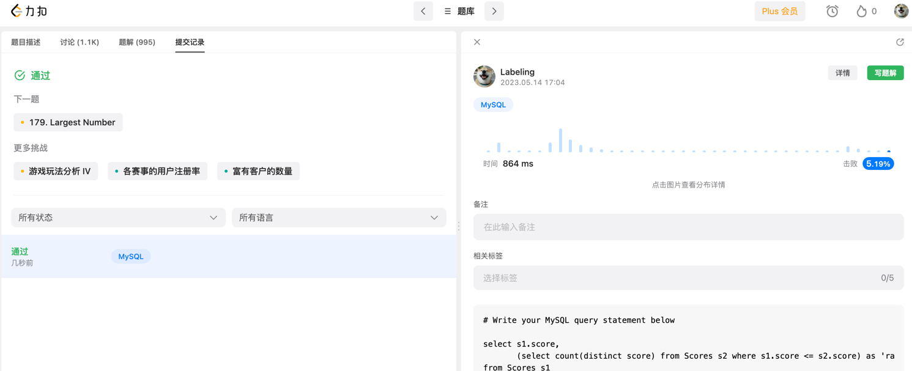

## Algorithm

* 自关联查询小于等于

## Review

[Grpc](https://medium.com/geekculture/why-grpc-is-the-future-of-software-architecture-baa68452a093)

* 快
* 双向流
* 协议丰富，格式丰富

## Tip

## Share

[微服务如何拆分](https://mp.weixin.qq.com/s/i1fg1FrvzngxkHlLqYa2Ew)

* 3个人维护一个微服务
* 避免循环依赖
* 职责单一