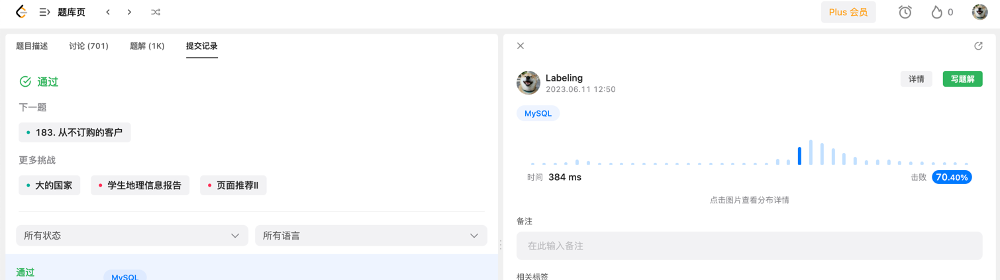

## Algorithm




## Review

[精益展会进度风险](https://medium.com/better-programming/how-to-update-your-status-during-stand-up-like-a-senior-engineer-f05f3c7f91e4)


## Tip
[java AQS](https://tech.meituan.com/2019/12/05/aqs-theory-and-apply.html)

* 使用双向队列维护顺序
* 使用compateswap，原子能力
* 使用volitile保证可见性

```java
public class MyLock {
    private static class Sync extends AbstractQueuedSynchronizer {
        @Override
        protected boolean tryAcquire (int arg) {
            return compareAndSetState(0, 1);
        }

        @Override
        protected boolean tryRelease (int arg) {
            setState(0);
            return true;
        }

        @Override
        protected boolean isHeldExclusively () {
            return getState() == 1;
        }
    }

    private Sync sync = new Sync();

    public void lock () {
        sync.acquire(1);
    }

    public void unlock () {
        sync.release(1);
    }
}

```

## Share
