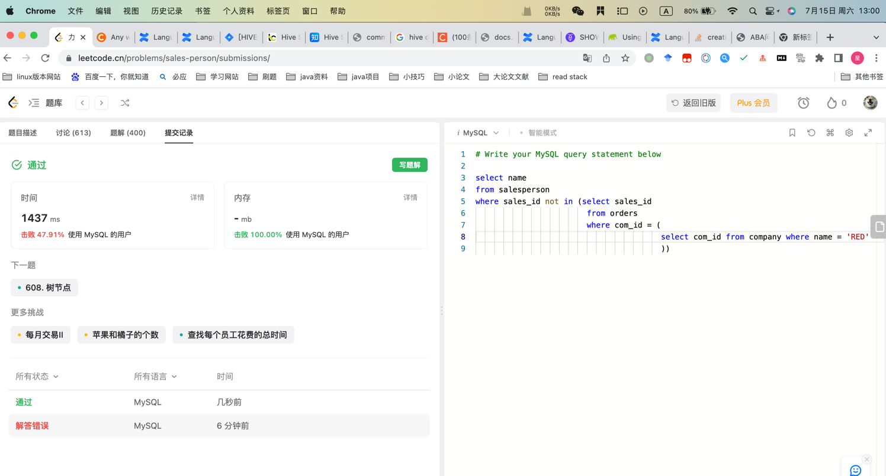

## Algorithm

## Review

[软件结构](https://medium.com/bytebytego-system-design-alliance/the-architects-blueprint-understanding-software-styles-and-patterns-with-cheatsheet-5c1f5fd55bbd)

## Tip

### 工作流Apache Airflow
https://chenzuoli.github.io/2021/10/24/airflow%E6%9E%B6%E6%9E%84%E8%AF%A6%E8%A7%A3/
* Dag，有向无环图
* Task，不同的Operator
airflow以dag为调度单位，一个dag包含一个或多个task。
dag文件定义了dag的调度详情，其中包含dag的基本信息和dag中task的基本信息。
scheduler不停地编译dag文件，根据dag文件中的crontab表达式、dag运行的历史记录、dag的开关状态，去发现哪些dag需要进行调度，发现了dag需要调度，立马新增一个dag_run实例，修改为running状态，接着不停地调度该dag中的task。

## Share
