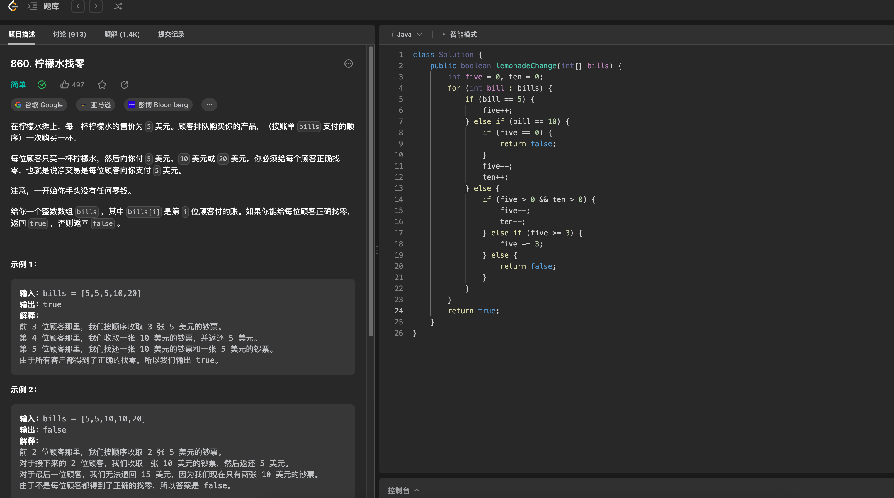

# Algorithm

# Review

[16 System Design Concepts I Wish I Knew Before the Interview.](https://levelup.gitconnected.com/16-system-design-concepts-i-wish-i-knew-before-the-interview-b8586e40a73b)

1. DNS
2. Load Balancer
3. API Gateway
4. CDN
5. Forward Proxy vs. Reverse Proxy
6. Caching
7. Data Partition
8. Database Replication
9. Microservices
11. NoSQL Databases
12. Databse Index
13. Distributed File Systems
14. Notification System
15. Full-text Search
16. Distributed Coordination Services

# Tip

# Share

使用K8s管理PVE基础设施：
https://github.com/dougsong/provider-proxmoxve