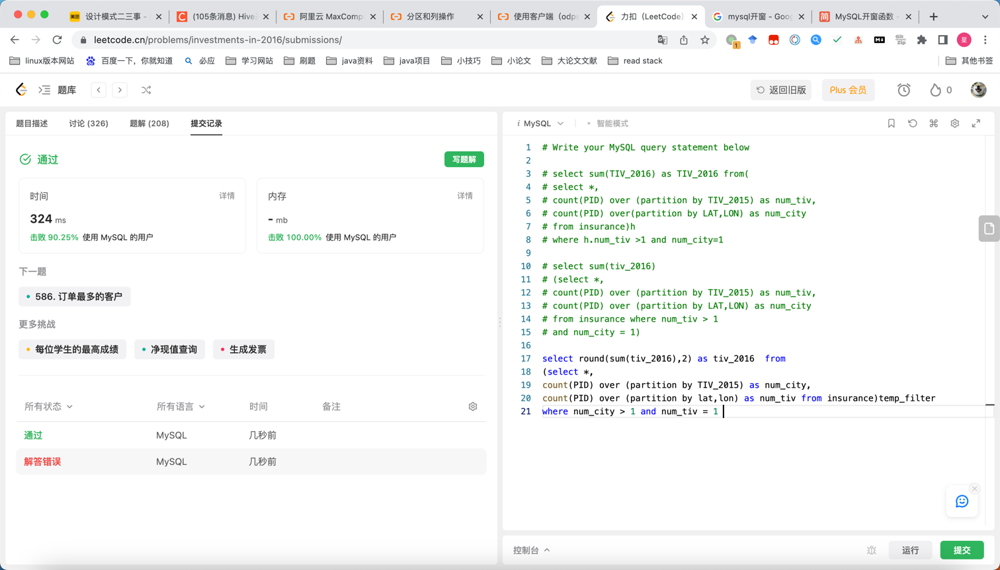

## Algorithm



* 递归注意当前层
* l1。next = merge（）。return l1。

## Review

[idea插件](https://medium.com/@xjpp22/top-10-plugins-for-intellij-idea-you-dont-want-to-miss-38a723e26140)

## Tip


## Share
Hive文件分隔符编码
https://www.jianshu.com/p/89bf7a209677
特殊分隔符，不可见
1.hive默认字段分隔符^A（使用vim文本编辑显示），常用ASCII八进制 '\001' 或者UNICODE编码十六进制 '\u0001' 进行设置；通过notepad++打开显示为SOH

2.hive特殊分隔符^B（使用vim文本编辑显示），常用ASCII八进制 '\002' 或者UNICODE编码十六进制 '\u0002' 进行设置；通过notepad++打开显示为STX

3.hive特殊分隔符^C（使用vim文本编辑显示），常用ASCII八进制 '\003' 或者UNICODE编码十六进制 '\u0003' 进行设置；通过notepad++打开显示为ETX·

简单测试了下文件转换，java编码，UTF-8，unicode，下周再测试下。
```java
package org.hx.java.encode;

import lombok.SneakyThrows;
import org.junit.Test;

import java.io.File;
import java.io.FileOutputStream;
import java.io.OutputStream;
import java.nio.charset.StandardCharsets;

public class ClientTest {

    public static final String STRING_CODE = "\\001";

    @SneakyThrows
    @Test
    public void name() {
        System.out.println(STRING_CODE);
        byte[] b1 = STRING_CODE.getBytes(); // 按系统默认编码转换，不推荐
        byte[] b2 = STRING_CODE.getBytes("UTF-8"); // 按UTF-8编码转换
        byte[] b3 = STRING_CODE.getBytes("GBK");
        System.out.println(b3);// 按GBK编码转换
        byte[] b4 = STRING_CODE.getBytes(StandardCharsets.UTF_8); // 按UTF-8编码转换
        System.out.println(b4);

        String s1 = new String(b1, "GBK"); // 按GBK转换
        System.out.println(s1);
        String s2 = new String(b1, StandardCharsets.UTF_8); // 按UTF-8转换
        System.out.println(s2);
    }

    @Test
    public void getSystemEncode() {
        // 获取当前系统编码
        System.out.println("系统默认编码：" + System.getProperty("file.encoding"));

    }

    @SneakyThrows
    @Test
    public void testWriteFile() {
        File f = new File(getDirectory() + File.separator + "test.txt");
        // 实例化输出流
        OutputStream out = new FileOutputStream(f);
        // 指定ISO8859-1编码
        byte b[] = "\\001".getBytes(StandardCharsets.UTF_16);
        // 保存转码之后的数据
        out.write(b);
        // 关闭输出流
        out.close();
    }


    @Test
    public void getFile() {
        System.out.println(getDirectory());
    }

    private String getDirectory() {
        String path = this.getClass().getClassLoader().getResource("log4j2-test.xml").getPath();
        String s = path.replaceAll("\\/", "\\\\\\\\");
        File directory = new File(path);//参数为空
        String courseFile = null;
        return directory.getParent();
    }
}

```