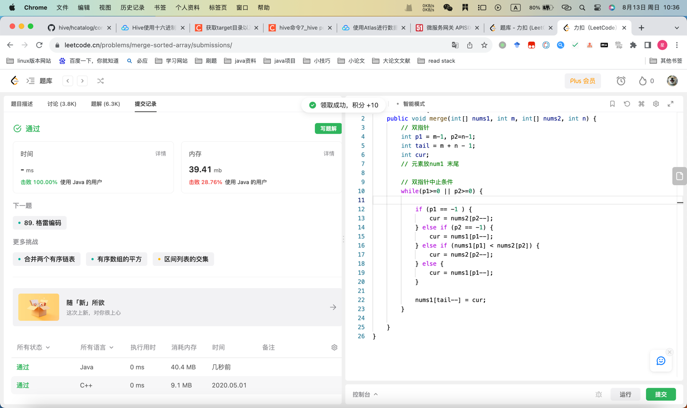

## Algorithm

## Review
[开源项目](https://github.com/KouShenhai/KCloud-Platform-Alibaba)
* Review找点开源项目学习学习

## Tip
### airflow调度周期与实例
使用的参数为schedule_interual，也就是定时任务执行的时间。
需要注意的是任务开始执行的时间为start_date加上schedule_interual的第二个周期开始执行，例如start_date为11月3日，schedule_interual为0 3 * * *，那么任务将会在11月4日凌晨3点开始执行。

实验一结果：只要某个task开始执行，那么无论是否超时，都会把该任务执行完，而后续依赖于该任务执行的任务都不会被执行。也就是20s会把t1.py执行完，80s会把t1.py和t2.py都执行完。

实验二结果：当在一个执行周期开始时，上一个周期的任务无论执行完没有，都会直接开始第二个周期的任务。
后续测试airflow当前任务执行时，该下个调度周期时是否会生成实例。
## Share
