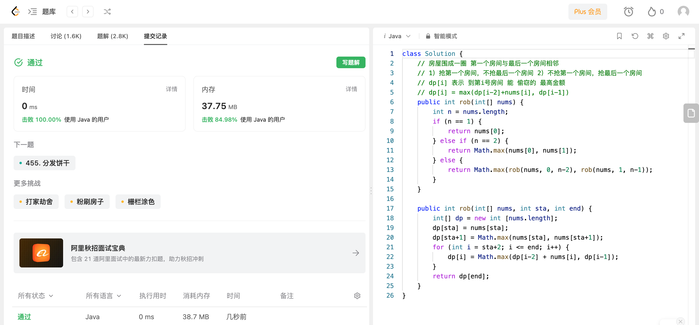

## Algorithm

# Review

[ViECap](https://arxiv.org/pdf/2307.16525.pdf)

https://github.com/FeiElysia/ViECap

一种用于生成图像描述的方法，该方法在图像描述的生成过程中融合了基于实体的hard prompts和soft prompts来指导语言模型的解码。hard prompts通过图像分类算法得到图像中的显著实体，soft prompts直接通过CLIP得到。

# Tips

# Share
