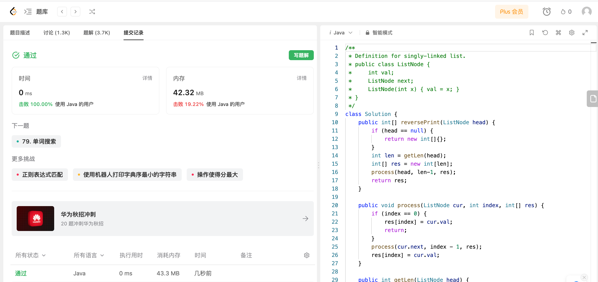

## Algorithm

# Review

[HSSDA](https://arxiv.org/pdf/2304.01464.pdf)

https://github.com/azhuantou/HSSDA

一种基于teacher-student网络的半监督3D目标检测框架，通过teacher网络里的双阈值策略，生成分层监督信息来训练student网络，并利用混洗数据增强方法强化student网络的表征能力。

# Tips

# Share
