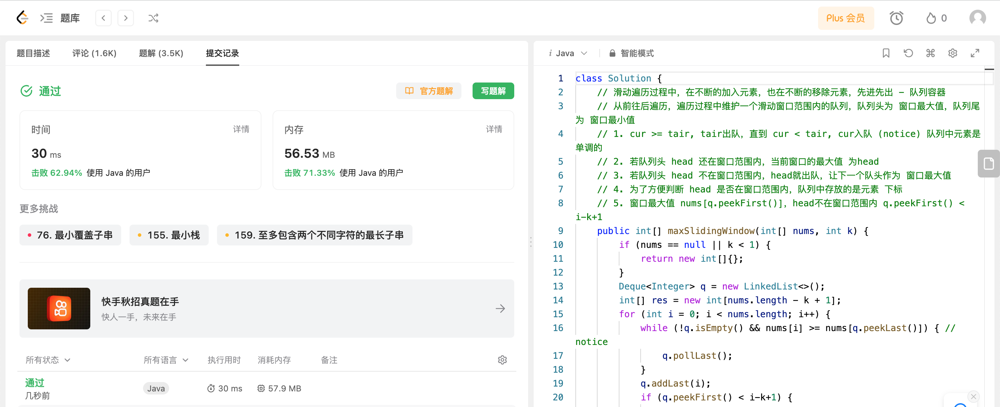

## Algorithm

# Review

[Large Separable Kernel Attention: Rethinking the Large Kernel Attention Design in CNN](https://arxiv.org/pdf/2309.01439.pdf)

大卷积核注意力模块的视觉注意力网络(VAN)在一系列基于视觉的任务上表现出卓越的性能，超越了视觉Transformer。
然而这类模块会随着卷积核大小的增加而导致计算和内存占用呈二次增加。
为了缓解这些问题，作者提出了一系列Large Separable Kernel Attention模块，称为LSKA。LSKA将深度卷积层的二维卷积核分解为级联的水平和垂直一维卷积核。

# Tips

# Share
