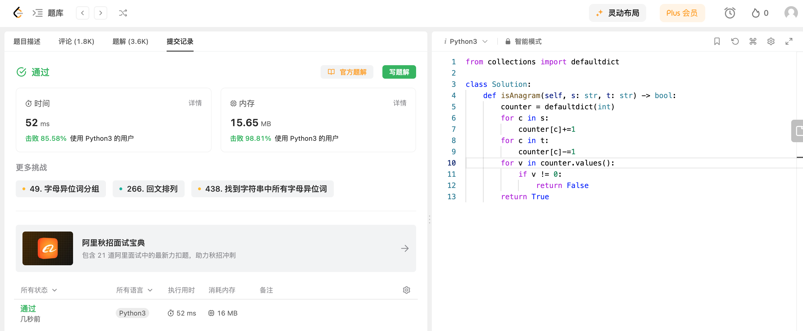

## Algorithm

# Review

[CityDreamer: Compositional Generative Model of Unbounded 3D Cities](https://arxiv.org/abs/2009.00610)

[CityDreamer](https://infinitescript.com/project/city-dreamer)

 CityDreamer专注于生成无边界的 3D 城市, 将建筑和城市背景（包括道路、绿化、水域）生成分别用 2 个不同的模块生成。CityDreamer 将 3D 城市生成分解为 4 步：无边界城市布局生成、城市背景生成、建筑实例生成和图像融合。

# Tips

# Share
