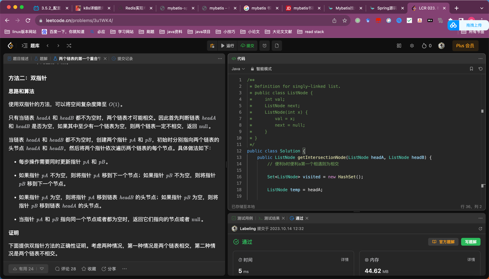

## Algorithm

* hash n n
* 相遇

## Review

[hue](https://docs.cloudera.com/runtime/7.2.17/using-hue/topics/hue-using.html)

## Tip
[领域服务命名](https://dinghuang.github.io/2021/03/18/DDD%E9%A2%86%E5%9F%9F%E9%A9%B1%E5%8A%A8%E8%AE%BE%E8%AE%A1/)

领域中的一些概念不太适合建模为对象，即归类到实体对象或值对象，因为它们本质上就是一些操作，一些动作，而不是事物。这些操作或动作往往会涉及到多个领域对象，并且需要协调这些领域对象共同完成这个操作或动作。如果强行将这些操作职责分配给任何一个对象，则被分配的对象就是承担一些不该承担的职责，从而会导致对象的职责不明确很混乱。但是基于类的面向对象语言规定任何属性或行为都必须放在对象里面。所以我们需要寻找一种新的模式来表示这种跨多个对象的操作，DDD认为服务是一个很自然的范式用来对应这种跨多个对象的操作，所以就有了领域服务这个模式。和领域对象不同，领域服务是以动词开头来命名的，比如资金转帐服务可以命名为MoneyTransferService。当然，你也可以把服务理解为一个对象，但这和一般意义上的对象有些区别。因为一般的领域对象都是有状态和行为的，而领域服务没有状态只有行为。需要强调的是领域服务是无状态的，它存在的意义就是协调领域对象共完成某个操作，所有的状态还是都保存在相应的领域对象中

## Share
