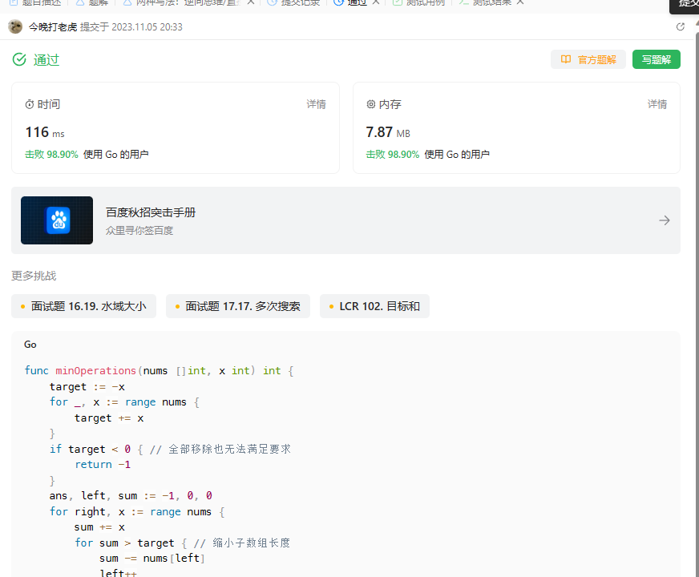

# Algorithm

# Review

[Singular Update Queue - Use a single thread to process requests asynchronously to maintain order without blocking the caller.](https://martinfowler.com/articles/patterns-of-distributed-systems/singular-update-queue.html)

# Tip

无

# Share
