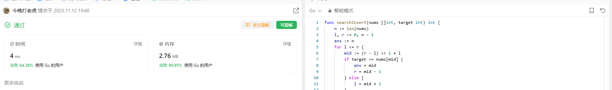

# Algorithm

# Review

[Single Socket Channel - Maintain order of the requests sent to a server by using a single TCP connection.](https://martinfowler.com/articles/patterns-of-distributed-systems/single-socket-channel.html)

# Tip

无

# Share
