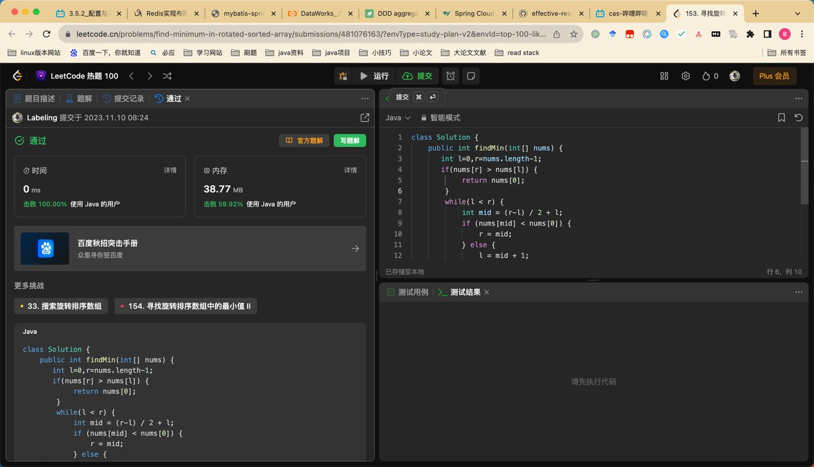

## Algorithm

## Review

[替代spring 框架](https://medium.com/@xantygc/stop-using-spring-boot-to-build-microservices-a8a17a2afaa3)

## Tip

二分法
条件：闭区间
变形：
1 旋转数组
2 旋转数组最小值 注意边界值
3 数组插入位置 
4 数组插入位置有重复数据 相等时条件移动

## Share
