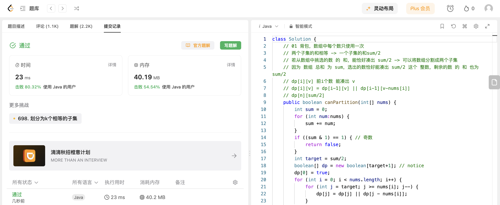

## Algorithm

# Review

[AnyText](https://github.com/tyxsspa/AnyText)

[ANYTEXT: MULTILINGUAL VISUAL TEXT GENERATION AND EDITING](https://arxiv.org/pdf/2311.03054.pdf)

现在已经有很多图像生成的模型以及应用，但现有模型生成的图像的文字区域往往是模糊、不可读或错误的。为了解决这个问题，提出了一种基于扩散的多语言视觉文本生成和编辑模型，专注于在图像中渲染准确连贯的文本。

# Tips

# Share
