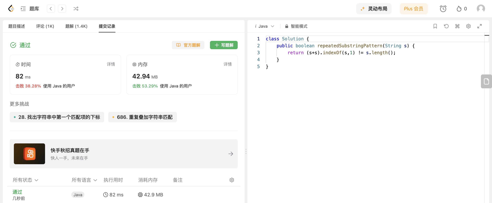

## Algorithm

# Review

[Is Underwater Image Enhancement All Object Detectors Need?](https://arxiv.org/pdf/2311.18814.pdf)

水下目标检测是海洋工程和水下机器人领域中一个重要且具挑战性的问题。水下图像相较于普通图像而言，由于存在光选择性吸收和散射，会导致图像质量下降。直觉上来说，水下图像的增强预处理可以为目标检测等模型带来好处。然而是否所有的目标检测器都需要水下图像增强作为预处理，该文使用了18种增强算法 * 7种基于深度学习的目标检测器，全面分析了水下图像增强对不同目标检测算法的影响。

# Tips

# Share
