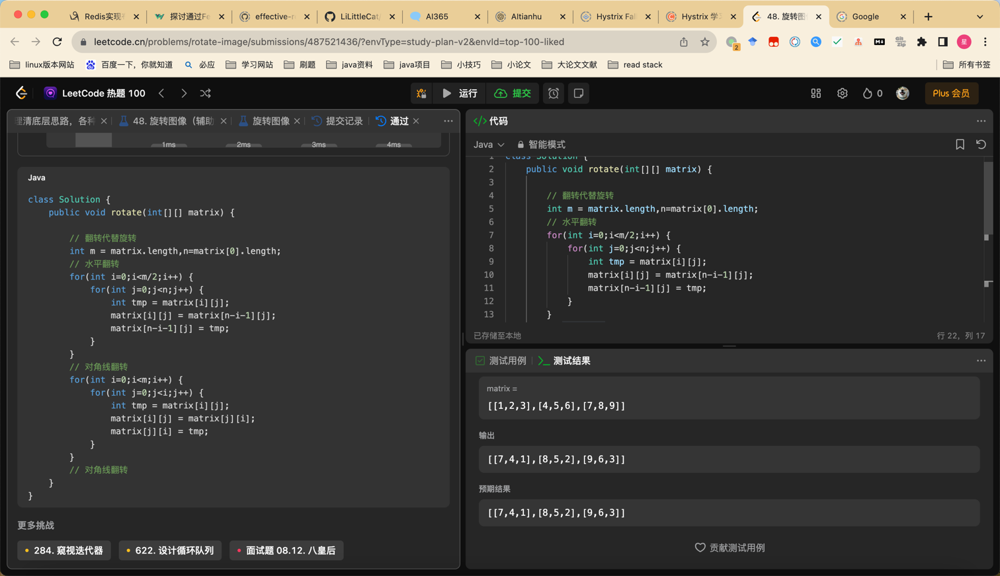

## Algorithm
day01 矩阵置0
* 使用标记，第一行第一列
* 两个变量存储标记
day03 翻转链表
* cur pre
* result = dfs(cur.nex,cur)
* cur.next = pre;
* return result
day04 螺旋数组
* 采用模拟策略 
* top bottom left right 定义终止条件，定义行与列。
* 定义初始值
day05 旋转图像
* 水平翻转
* 对角翻转
  

## Review

[story of chat_gpt reasoning](https://medium.com/@lessig/chatgpt-or-how-i-learned-to-stop-worrying-and-love-ai-242f181723af)

## Tip

## Share
进程，提供基础工具
线程，货车
任务，运送货物
线程都有自己独立的栈空间，两个线程都不相互影响
一个进程可以包含多个线程，且这些线程共享同一个进程空间中的所有资源，包括堆、全局变量和静态变量等。但是，每个线程都拥有独立的栈空间.
