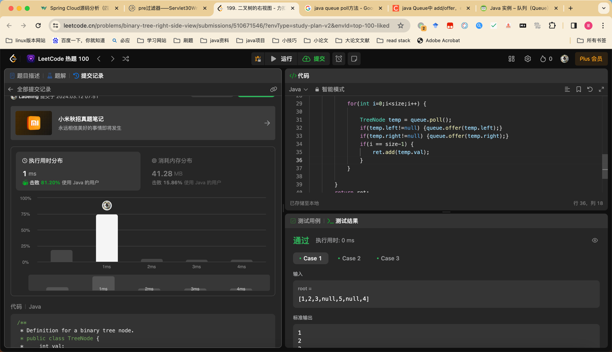

## Algorithm

### day02 二叉树层序遍历
* 第一个while
* 第二个使用for循环处理队列元素

### day03 将二叉树转换为链表
* 使用递归，画图

## Review

[可扩展性](https://www.javacodegeeks.com/2024/03/the-future-of-scalability-is-pool-architecture-the-answer.html?ref=dailydev)

* 

## Tip

[nginx高可用](https://www.cnblogs.com/SimpleWu/p/11004902.html)

* keepalived 生产Nginx高可用

## Share
