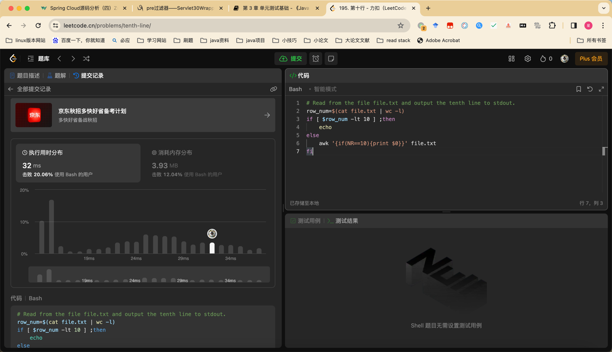

## Algorithm
day03 
* awk + if
  
## Review

[API认证](https://blog.bitsrc.io/best-practices-for-api-security-6d8242587caf)

* 认证与授权
* role based ：user role permissions
* encryption data 
  - nginx 
  - mysql 
  - application

## Tip

mapstruct

ctrl + shift + f9 重新编译当前类

## Share
