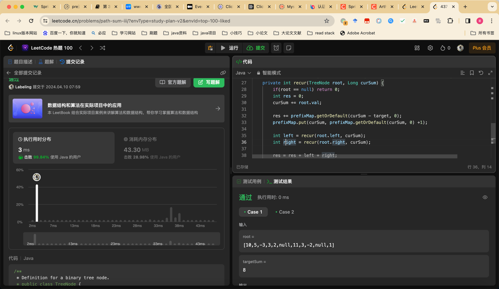

## Algorithm

- 前缀和定义
- 用它干什么
- HashMap存的是什么
- 恢复状态代码的意义

## Review

[系统设计](https://levelup.gitconnected.com/system-design-interview-question-design-spotify-4a8a79697dda)

- 估算存储
- 设计主键、外键
- 扩展设计

## Tip

## Share
