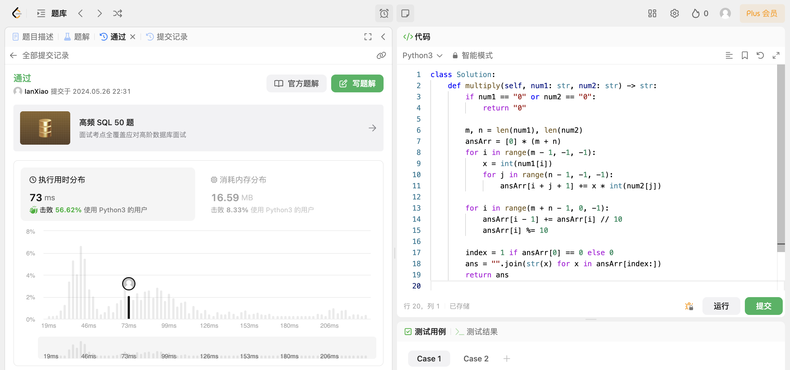

## Algorithm

# Review

[Prompt工程技巧分享](https://towardsdatascience.com/how-i-won-singapores-gpt-4-prompt-engineering-competition-34c195a93d41#183c)

新加坡政府科技局举办的首届GPT-4提示词工程大赛冠军Sheila Teo分享了她的提示词撰写技巧及案例分析。包括：1. 使用CO-STAR框架构建提示; 2. 使用分隔符分段提示; 3. 使用LLM护栏创建系统提示; 4. 仅使用LLM分析数据集, 无需插件或代码.

# Tips

# Share
