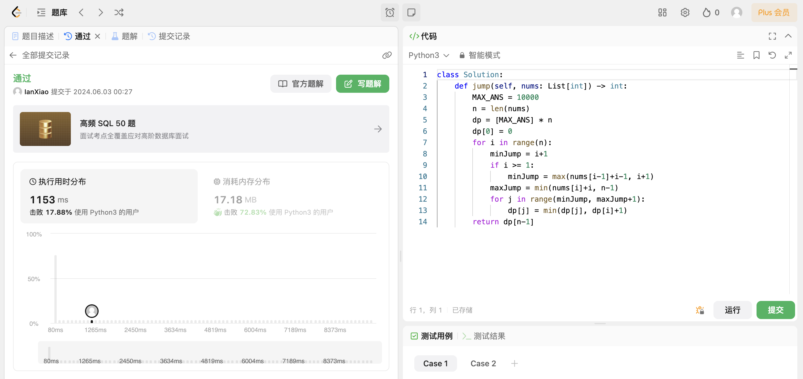

## Algorithm

# Review

[MVSGaussian](https://mvsgaussian.github.io/)

[Fast Generalizable Gaussian Splatting
Reconstruction from Multi-View Stereo](https://arxiv.org/pdf/2405.12218)

该模型能够从稀疏多视角图像中学习场景的3D高斯表征。通过结合多视角立体（MVS）的显式几何推理和高斯溅射实时渲染的优势，MVSGaussian在泛化推理上表现出色，能够以最快的速度实现最佳的视图渲染质量。

# Tips

# Share
