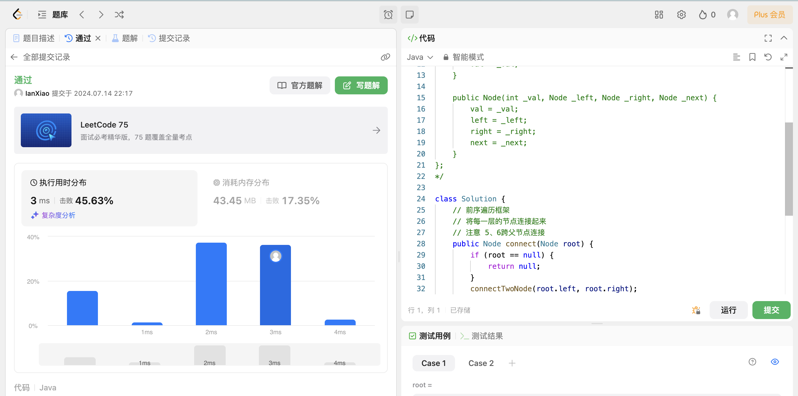
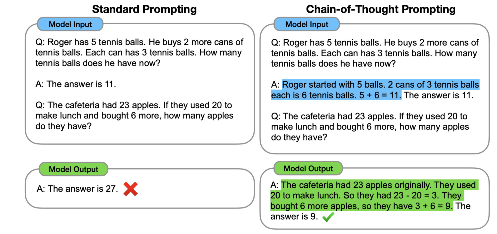

## Algorithm

# Review

[Chain-of-Thought Prompting Elicits Reasoning in Large Language Models](https://proceedings.neurips.cc/paper_files/paper/2022/file/9d5609613524ecf4f15af0f7b31abca4-Paper-Conference.pdf)

论文中给出了一个大模型通过思维链做数学题的示例。图左和图右，大模型都读入了 OneShot 示例，但是图左只给出了答案，而图右则在 OneShot 示例中给出了解题的具体思路。结果，只给出了答案的模型推理错误，而给出解题思路后，同一个模型生成了正确的答案。

# Tips

# Share
