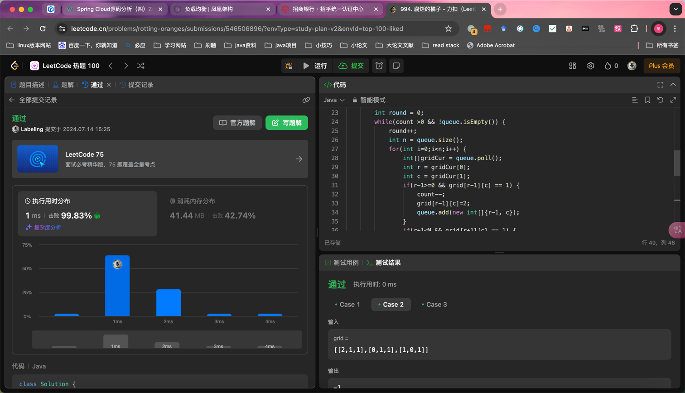

## Algorithm

- 多源BFS
- 入queue 一次性出去

## Review

[数据库缩放](https://blog.algomaster.io/p/system-design-how-to-scale-a-database?ref=dailydev)
- 垂直扩容：cpu mem
- 索引
- 分片：3亿数据，三个1亿数据库
- Vertical Partitioning
- 缓存
- 副本：Replication
- 物化视图
- 数据冗余

## Tip

## Share
