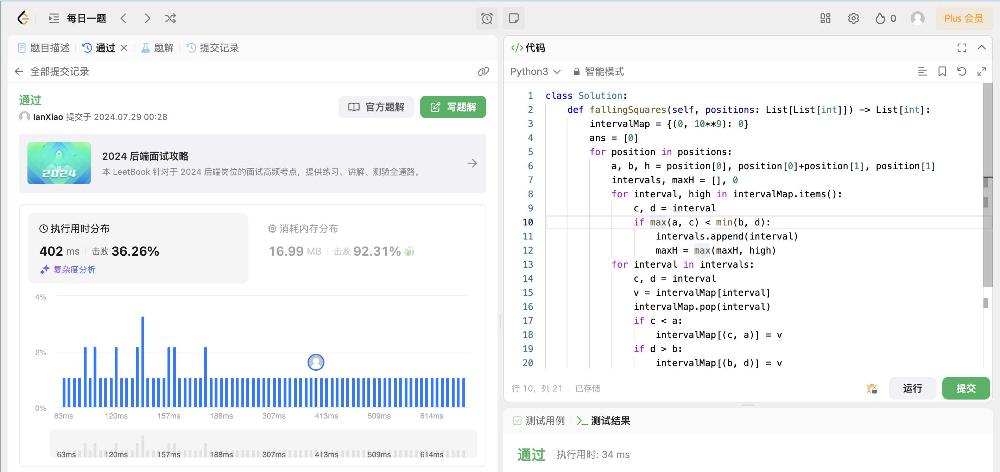

## Algorithm

# Review

[ART: Automatic multi-step reasoning and tool-use for large language models](https://arxiv.org/pdf/2303.09014)

介绍了一种新框架，用于解决LLM在处理复杂任务时需要手动编写程序的问题。改框架可以自动选择任务库中的多步推理和工具使用的演示，并无缝暂停和恢复生成过程以整合外部工具的输出。

# Tips

# Share
