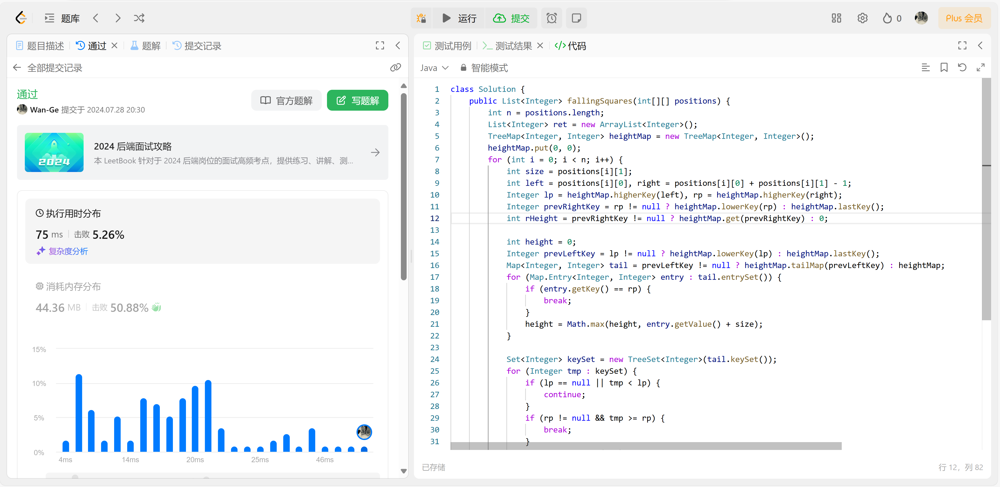

## Algorithm

## Review

### **[17 Mindblowing Python Automation Scripts I Use Everyday](https://medium.com/pythoneers/17-mindblowing-python-automation-scripts-i-use-everyday-523fb1eb9284)**

## Tip

在 jupyter 中如果需要绘制类似折现图、柱状图之类的，使用 plotly 会更合适。API简单且图片美观，相较于最原始的  matplotlib 更好用。

## Share

无