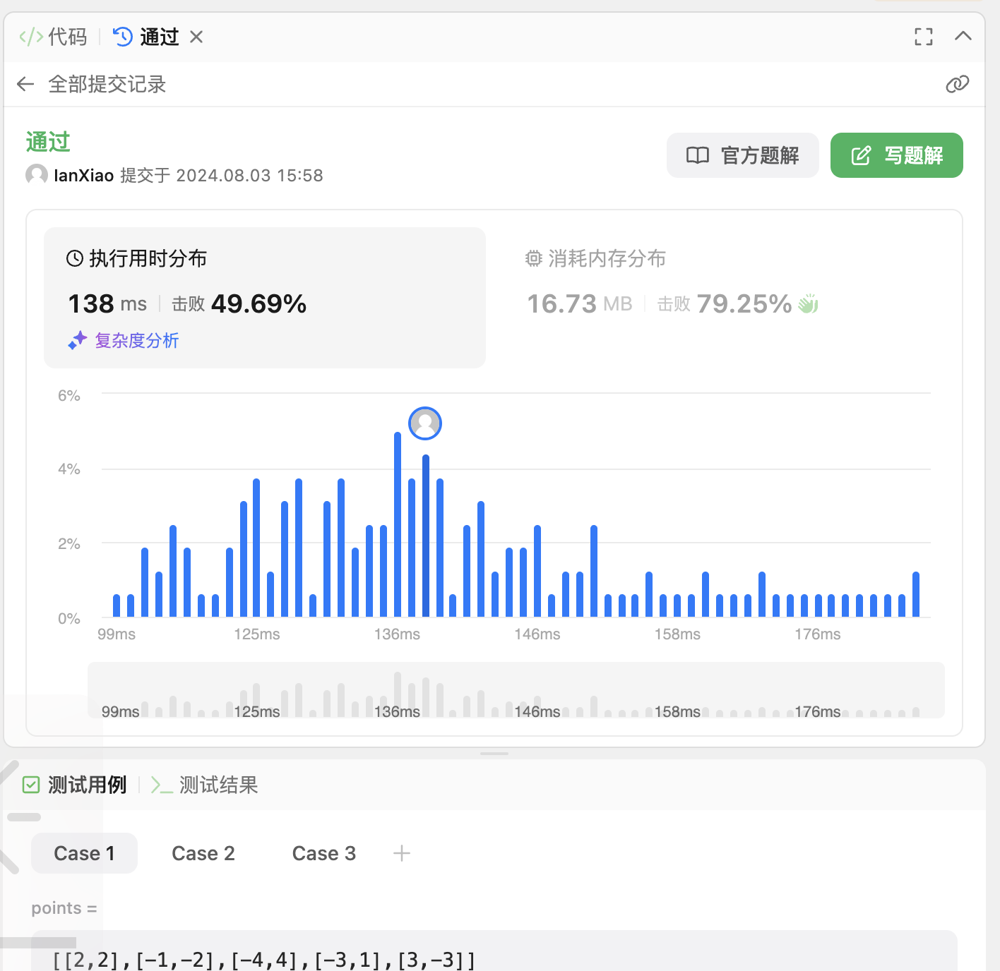

## Algorithm

# Review

[FSD-BEV: Foreground Self-Distillation for Multi-view 3D Object Detection](https://arxiv.org/abs/2407.10135)

FSD-BEV是一种前景蒸馏的算法框架，框架中教师分支利用激光雷达点云生成的硬标签来获得高质量的教师BEV空间特征并位学生分支提供指导。
同时，学生模型利用预测出来的软标签来填补硬标签的空缺补偿教师模型

# Tips

# Share
